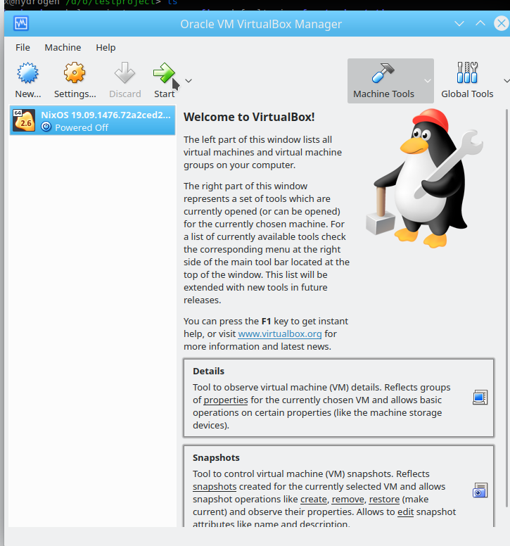
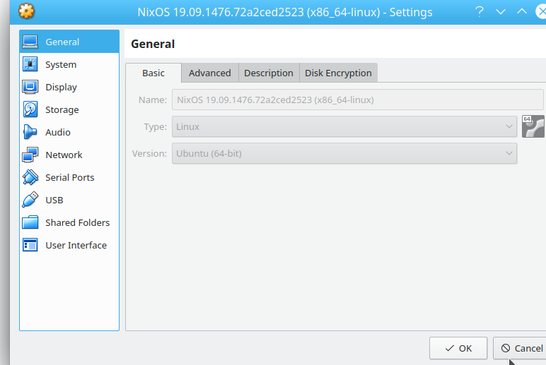
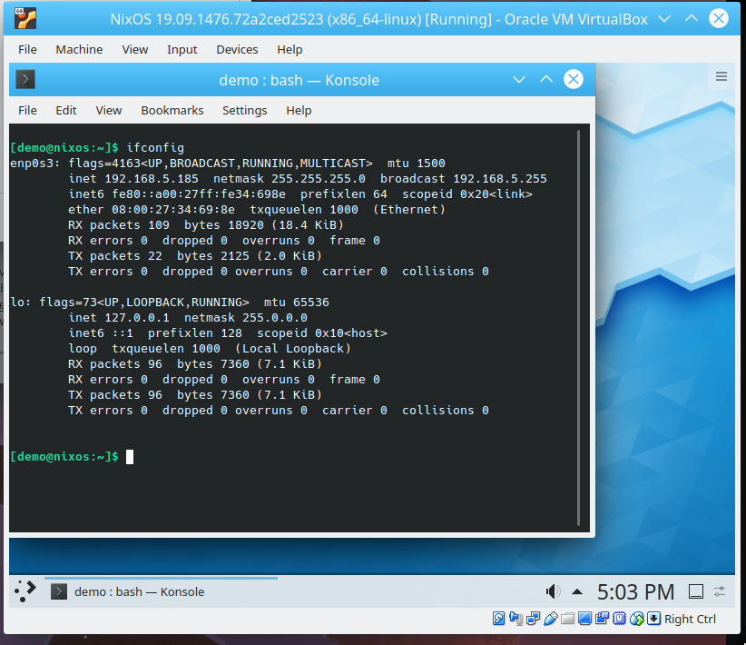
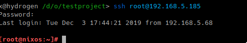

# Obelisk Application Deployment Guide
This document serves two purposes, the first one is to guide new users that want to deploy Obelisk/Reflex apps and the second one to provide a walkthrough for test driving obelisk releases.


> NOTE: This guide assumes you have access to a MacOS machine running the
> latest OSX release, a NixOS machine (can be a VM on that mac) an
> iPhone or iPad and a recent Android device. It also assumes that you
> have Nix correctly set up and that your system is set up to fetch from
> binary caches instead of building everything on your machine. If you
> notice any of the commands below takes more than 5 minutes, then
> caches are not enabled.
>
> For example:
>
> `/etc/nixos/configuration.nix`
>
> ```nix
> nix.binaryCaches = [ "https://cache.nixos.org/" "https://nixcache.reflex-frp.org" ];
> nix.binaryCachePublicKeys = [ "ryantrinkle.com-1:JJiAKaRv9mWgpVAz8dwewnZe0AzzEAzPkagE9SP5NWI=" ];
> ```
>
> or
>
> `/etc/nix/nix.conf`
>
> ```nix
> binary-caches = https://cache.nixos.org/ https://nixcache.reflex-frp.org
> trusted-binary-caches =
> binary-cache-public-keys = cache.nixos.org-1:6NCHdD59X431o0gWypbMrAURkbJ16ZPMQFGspcDShjY= ryantrinkle.com-1:JJiAKaRv9mWgpVAz8dwewnZe0AzzEAzPkagE9SP5NWI=
> ```


## a) Get Obelisk

There are several ways to install Obelisk, but the one we are going to use here allows us to test a single version of obelisk in different ways: the approach is to clone obelisk from it's github repository (master, develop or qa branches) and start a project that uses that local check out.

First, let's open a terminal, navigate to the path of your choice and define a variable called `WORKDIR` to help us avoid running commands in the wrong folder.

~~~
export WORKDIR=$(pwd)
~~~

Then let's get obelisk from Github using the qa branch:

~~~
git clone https://github.com/obsidiansystems/obelisk -b qa "$WORKDIR/obelisk"
~~~

Once you have an obelisk check out, you can build it using Nix. And make a shortcut (alias) for the rest of the terminal session. With this, you will be able to type `ob` anywhere else in the system as long as you do not close the terminal.

~~~
nix-build $WORKDIR/obelisk -A command
alias ob=$WORKDIR/obelisk/result/bin/ob
~~~

In order to start an obelisk project, we need to create an empty directory, let's call it `myapp`:

~~~
mkdir -p "$WORKDIR/myapp"
cd "$WORKDIR/myapp"
ob init --symlink "$WORKDIR/obelisk"
~~~

> Note: If the --symlink parameter is not used, then obelisk sets your project
> up to look at the master branch from Github. This is quite handy for
> real life projects but distracting for our test drive since we want to
> make sure any changes we do to the obelisk codebase  (like testing a
> pull request) are immediately picked up.

## b) Deploy a web app on localhost

Let's test that we can run a server on localhost, this is quite easy:

~~~
cd "$WORKDIR/myapp"
ob run
~~~

Now open a browser and point it to http://localhost:8000 ( <- or just click on this link). You will see the following:


## c) Deploy a web app on a remote machine


Install VirtualBox on your machine.

On NixOS do this by adding the following line to your `/etc/nixos/configuration.nix`:

```
virtualisation.virtualbox.host.enable = true;
```

then `sudo nixos-rebuild switch`.

The NixOS download page has a section called VirtualBox image. Download that as the target system. The author used 19.09 .ova files: https://nixos.org/nixos/download.html

With the downloaded file, open VirtualBox and import the .ova file:


leave the default settings, that will take a few minutes:


then click on start:



Make sure the selected Processor is Ubuntu-64 and not Ubuntu-32.



If you are on a network with DHCP on your wireless or network card then select Bridged Adapter in network:


You will then have a fully booted NixOS machine:


Then open up Konsole by clicking on the start menu and typing it and type ifconfig to learn the target ip address:



Change the system configuration using sudo to enable ssh access:

```bash
sudo nano /etc/nixos/configuration.nix
```


You need to have

```nix
  services.openssh.enable = true;
  services.openssh.permitRootLogin = "yes";
```

and then Ctrl+O and Ctrl+X.

Now run `sudo nixos-rebuild switch` and then set the root password to anything you want using `sudo passwd root`.

With that you will be able to SSH into that machine from a terminal, using the username root and the IP address you found out during the previous step:



Create a new SSH key with ssh-keygen called obtest and leave it on the local folder:

```shell
ssh-keygen -t ed25519 -f obtest -P ""
```

Now copy your local SSH key to the server to enable passwordless login:

```bash
ssh-copy-id -i obtest.pub root@192.168.5.185
```

With that, we can come back to obelisk and  deploy the system:

```
mkdir $WORKDIR/myappdeploy
ob deploy init --ssh-key obtest --admin-email a@a.a --hostname 192.168.5.185 --route https://192.168.5.185 $WORKDIR/myappdeploy
cd $WORKDIR/myappdeploy
ob deploy push
```


And then navigate to: http://192.168.5.185 (adjust for your IP address) and make sure you see the same obelisk image.


Congratulations! You have deployed an Obelisk application to a remote server via ssh.


## d) Deploy an Android app (from NixOS)

If you are following along, you could do this from the NixOS VM you created in an earlier step but you would need to add a USB device mapping so that the USB connection can be seen from the guest VM.

Modify `myapp/default.nix` to set `config.android_sdk.accept_license = true;` and then build the android app:

```nix
nix-build -A android.frontend -o result-android
```

There will be an android app in `./result-android/android-app-debug.apk`

After that, make sure  *USB debugging* is enabled n your Android device ([instructions here](https://developer.android.com/studio/debug/dev-options) and connect the device using USB (be sure to confirm any security prompts on the device)


Congratulations!  You have deployed an Obelisk Android app via USB.


## e) Deploy an iOS app

Verify that you can see the device from XCode and you have installed a Provisioning profile that links your Apple Developer Id and the Device identifier. The workflow depends on wether or not you are an independent developer or part of an organization and is out of scope for this manual.


First, create the app:

```nix-build -A ios.frontend -o result-ios```

this will generate a `result-ios` folder that looks similar to this:


and then find your `Team ID` at the following url (Apple Developer Membership details): https://developer.apple.com/account/#/membership/

It will be something like `5B445B3WY1` with that, you can start the deployment workflow after plugging in an iPhone or iPad via USB and setting it to trust the computer:


If there are no errors and the last line says `100% Installed Package` you can open the device and look for the Obelisk app:


Congratulations, you have deployed an Obelisk app on an iOS device.

You are now ready to create your own multi platform application using Obelisk!

