# Obelisk Application Deployment Guide
This document serves two purposes, the first one is to guide new users that want to deploy Obelisk/Reflex apps and the second one to provide a walk-through for test driving Obelisk releases.

> **Note:** To complete this *entire* guide you need access to a macOS machine running the latest OSX release, a Linux machine (can be a VM on that mac) with Nix installed, an iPhone or iPad, and a recent Android device. It also assumes that you have Nix correctly set up and that your system is set up to fetch from binary caches instead of building everything on your machine. If you notice any of the commands below takes more than 5 minutes, then caches are not likely enabled.
>
> Refer to the [Obelisk Installation Documentation](https://github.com/obsidiansystems/obelisk#installing-obelisk) for instructions on configuring the binary caches for any Nix-compatible setup.

## a) Get Obelisk

There are several ways to install Obelisk, but the one we are going to use here allows us to test a single version of Obelisk in different ways. The approach is to clone Obelisk from it's GitHub repository and start a project that uses that local check out.

Open a terminal and run the following:

```bash
export WORKDIR=~/obelisk-guide
mkdir -p "$WORKDIR"
```

Then let's get Obelisk from GitHub using a specific branch:

```bash
export OBELISK_BRANCH=develop
git clone https://github.com/obsidiansystems/obelisk.git -b "$OBELISK_BRANCH" "$WORKDIR/obelisk"
```

Once you have an Obelisk check out, you can build it using Nix and make a shortcut (alias) for the rest of the terminal session. With this you will be able to type `ob` anywhere as long as you do not close the terminal.

```bash
alias ob=$(nix-build "$WORKDIR/obelisk" -A command --no-out-link)/bin/ob
```

In order to start an Obelisk project, we need initialize it in a new directory. Let's call it `myapp`:

```bash
mkdir -p "$WORKDIR/myapp"
cd "$WORKDIR/myapp"
ob init --branch "$OBELISK_BRANCH"
```

> **Note:** If the `--branch` parameter is not used, then Obelisk sets your project up to look at the `master` branch from GitHub. This is quite handy for real life projects but distracting for our test drive since we want to make sure any changes we do to the Obelisk codebase (like testing a pull request) are immediately picked up.

## b) Run the Obelisk app on localhost

Let's test that we can run a server on localhost. This is quite easy:

```bash
cd "$WORKDIR/myapp"
ob run
```

Now open a browser and point it to http://localhost:8000 (or just click on this link). You should see the following:

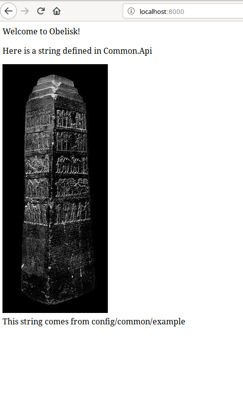

## c) Deploy the web app on a remote machine

### Import the NixOS VirtualBox appliance
Install [VirtualBox](https://www.virtualbox.org/) on your machine.

On NixOS, do this by adding the following line to your `/etc/nixos/configuration.nix` before the last line containing `}`:

```nix
  virtualisation.virtualbox.host.enable = true;
```

then `sudo nixos-rebuild switch`.

The NixOS [download page](https://nixos.org/nixos/download.html) has a section called "VirtualBox appliances". Download that as the target system. The author used the 19.09 `.ova` file.

With the downloaded file, open VirtualBox and import the `.ova` file:

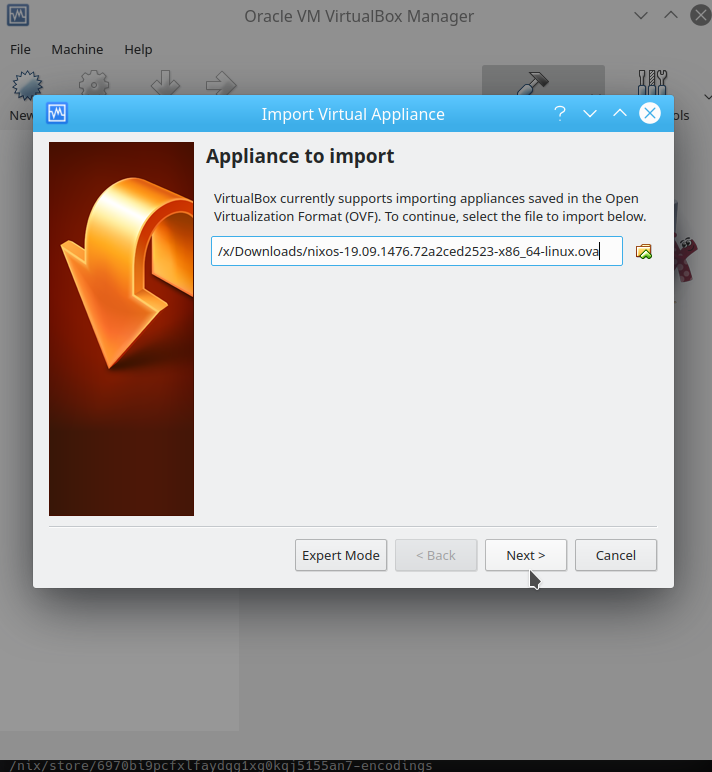

Leave the default settings and finish the import. That will take a few minutes:

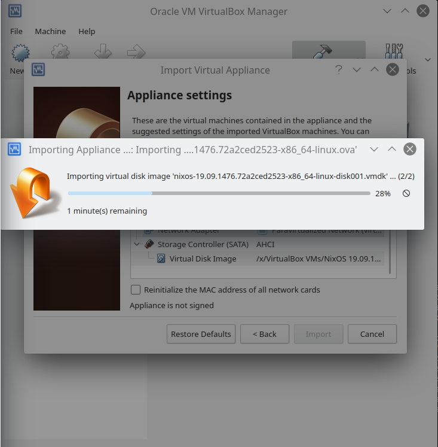

You should now see a NixOS machine in the dashboard:

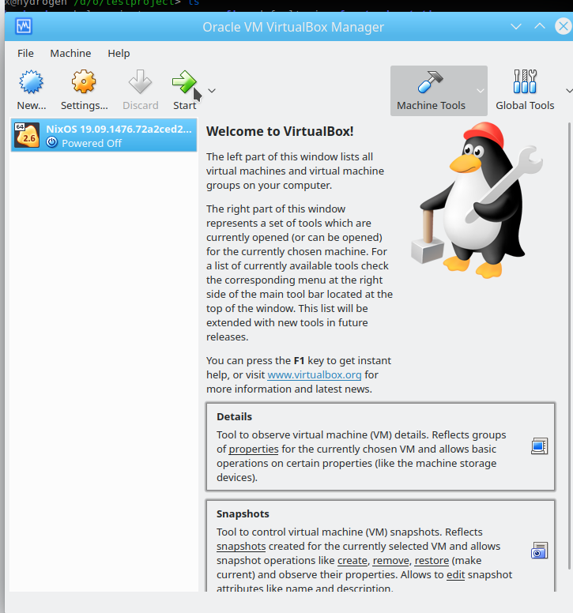

If you are on a network with DHCP on your wireless or network card then select right-click on the "NixOS" image and click "Settings". Go to the "Network" section and make "Attached to:" set to "Bridged Adapter".

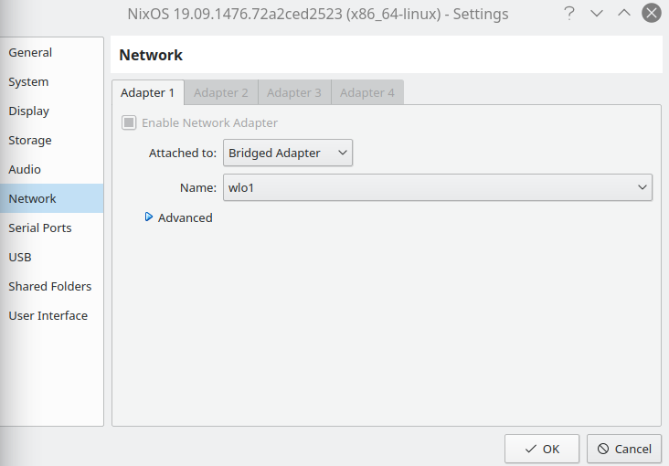

Finally, double-click on the "NixOS" machine and wait for it boot up. If it asks for a password, use `demo`.

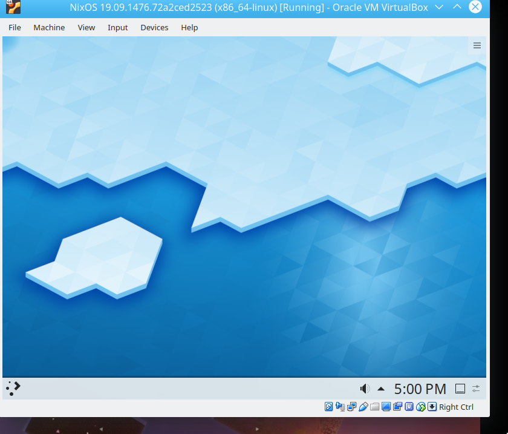

### Configure the virtual machine for SSH

Inside the virtual machine open up "Konsole" by clicking on the start menu in the bottom left corner and typing in "Konsole" until you see it as an option in the menu. Then click on it to open it.

Change the system configuration using `sudo` to enable SSH access:

```bash
sudo nano /etc/nixos/configuration.nix
```

This will ask you to enter your password. Enter `demo`.

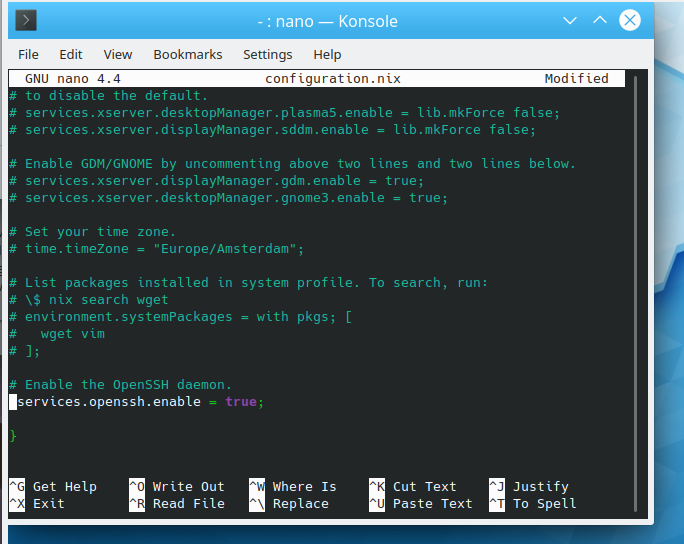

You need to add the following snippet right before the final line containing `}`.

```nix
  services.openssh.enable = true;
  services.openssh.permitRootLogin = "yes";
```

Save and close the editor by typing <kbd>Ctrl</kbd>+<kbd>O</kbd>, <kbd>Enter</kbd>, and then <kbd>Ctrl</kbd>+<kbd>X</kbd>.

Now run `sudo nixos-rebuild switch` (if it asks for a password, again use `demo`) and then set the root password using `sudo passwd root`. Pick a simple password like `root`. You'll need to use it again.

To get the virtual machine's IP address go back to the terminal on your *host* machine (not the virtual machine) and run:

```bash
export VM_ID=$(VBoxManage list runningvms | grep "NixOS" | awk -F'[{}]' '{print $2}')
echo "$VM_ID"
```

You should see a single identifier that looks like `388bbbe5-e0a2-4b20-9c76-bbaa5746682e`. If you see anything else then you likely you have multiple NixOS machines running. Stop any other machines and run this command again. (Of course, if you're a power user, just change the `grep` to pick out right VM.)

Now get the IP address for that machine:

```bash
export VM_IP=$(VBoxManage guestproperty enumerate "$VM_ID" | grep /V4/IP | awk '{print $4}' | sed 's/,//')
echo "$VM_IP"
```

You should see an IP like `192.168.7.86`.

With that you will be able to SSH into that machine from a terminal, using the username `root`.

```bash
ssh root@$VM_IP echo "Access granted"
```

This may ask if you want to trust the fingerprint for this server. Answer `yes`. It will ask you for a password. Enter the one you specified above. You should see `Access granted` printed after you type your password and hit <kbd>Enter</kbd>.

> **Note:** If instead you see an error like this
>
> ```
> @@@@@@@@@@@@@@@@@@@@@@@@@@@@@@@@@@@@@@@@@@@@@@@@@@@@@@@@@@@
> @    WARNING: REMOTE HOST IDENTIFICATION HAS CHANGED!     @
> @@@@@@@@@@@@@@@@@@@@@@@@@@@@@@@@@@@@@@@@@@@@@@@@@@@@@@@@@@@
> IT IS POSSIBLE THAT SOMEONE IS DOING SOMETHING NASTY!
> Someone could be eavesdropping on you right now (man-in-the-middle attack)!
> It is also possible that a host key has just been changed.
> ```
>
> you need to remove the old fingerprint for this IP. Run the following:
>
> ```bash
> sed -i "/^$VM_IP /d" ~/.ssh/known_hosts
> ```
>
> and then try the previous `ssh` command again.

Now we'll allow access with an SSH key instead of a password. Create a new SSH key with `ssh-keygen`:

```bash
ssh-keygen -t ed25519 -f "$WORKDIR/obkey" -P ""
```

Now copy your local SSH key to the server:

```bash
ssh-copy-id -i "$WORKDIR/obkey.pub" root@$VM_IP
```

This will ask you for your password again.

Now test login with your key instead:

```bash
ssh -i "$WORKDIR/obkey" root@$VM_IP echo "Access granted"
```

This should print `Access granted` *without* asking for a password.

### Configure the git remote

Before the project can be deployed, it needs to be a valid `git` repository.

> **Note:** You need `git` installed and configured. You can do that with:
>
> ```bash
> nix-env -i git
> git config --global user.name "John Doe"
> git config --global user.email johndoe@example.com
> ```

```bash
git init --bare "$WORKDIR/myapp-git-remote"
cd "$WORKDIR/myapp"
git init
git add --all
git commit -m "initial commit"
git remote add origin "$WORKDIR/myapp-git-remote"
git push -u origin master
```

### Deploy

With that, we can come back to the Obelisk app and initialize the deployment:

```bash
cd "$WORKDIR/myapp"
ob deploy init --ssh-key "$WORKDIR/obkey" --admin-email a@a.a --hostname $VM_IP --route https://$VM_IP "$WORKDIR/myappdeploy" --disable-https
```

Then configure the deployment for VirtualBox:

```bash
echo '{nixosPkgs, ...}: {...}: { imports = [ (nixosPkgs.path + /nixos/modules/virtualisation/virtualbox-image.nix) ]; }' > "$WORKDIR/myappdeploy/module.nix"
```

And deploy:

```bash
cd "$WORKDIR/myappdeploy"
ob deploy push -v
```

Once that is complete, open the webpage with

```bash
xdg-open http://$VM_IP
```

If that fails, just get the URL by running

```bash
echo http://$VM_IP`
```

and copy/paste that URL into your browser navigation input.

It should look like this:

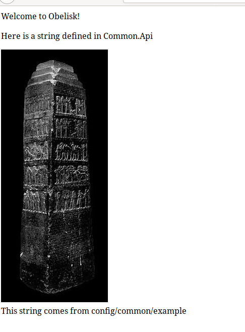

Congratulations! You have deployed an Obelisk application to a remote server via SSH.

## d) Deploy an Android app (Linux host only)

> **Note:** This section requires that you be running a Linux *host*.

Modify `$WORKDIR/myapp/default.nix` to set `config.android_sdk.accept_license = true;` and then update your app.

```bash
cd "$WORKDIR/myapp"
sed -i 's/# config.android_sdk.accept_license = false;/config.android_sdk.accept_license = true;/g' default.nix
git add default.nix
git commit -m"Accept license"
git push
```

Make sure *USB debugging* is enabled in your Android device ([instructions here](https://developer.android.com/studio/debug/dev-options) and connect the device using USB. Be sure to confirm any security prompts on the device.

Now update your deployment and deploy to Android:

```bash
cd "$WORKDIR/myappdeploy"
ob deploy update
ob deploy test android -v
```

This deployment will ask you to create a password (at least 6 characters long) and then ask you a series of questions. You can pick arbitrary answers. If the deployment fails, try using different USB ports on your computer and running `ob deploy test android -v` again. The USB cable you use can also make a difference.

When connecting your Android device you may be asked to "Allow USB debugging". You need to allow it.
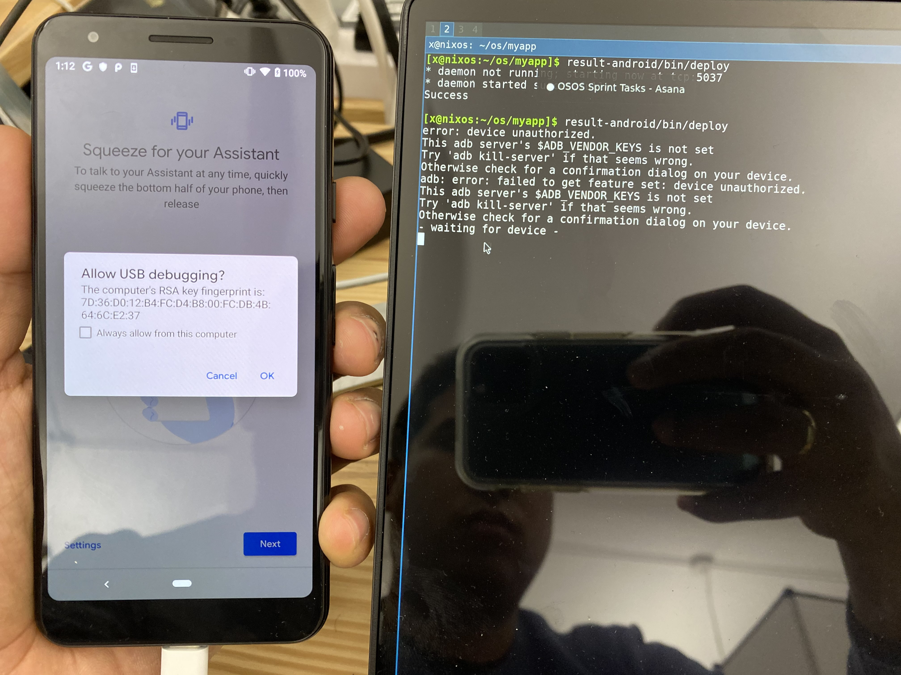


When the deployment is complete opening the app should look something like

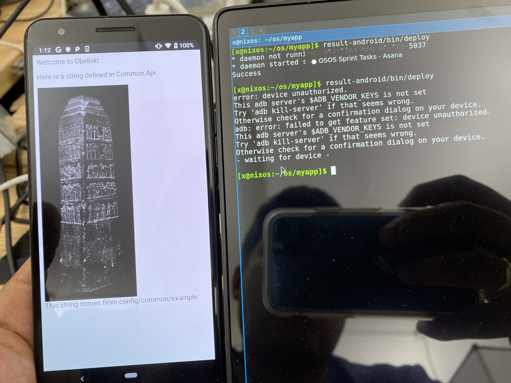

Congratulations! You have deployed an Obelisk Android app via USB.

## e) Deploy an iOS app (macOS host only)

> **Note:** This section requires that you be running a macOS *host*.

Verify that you can see the device from XCode and you have installed a Provisioning profile that links your Apple Developer Id and the Device identifier. The workflow depends on whether or not you are an independent developer or part of an organization and is out of scope for this manual.

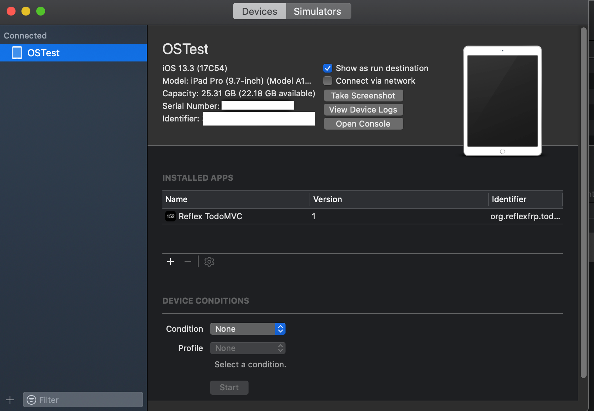

Find your `Team ID` at the following URL (Apple Developer Membership details): https://developer.apple.com/account/#/membership/

It will be something like `5B445B3WY1`. With that, you can start the deployment workflow after plugging in an iPhone or iPad via USB and setting it to trust the computer:

```bash
cd "$WORKDIR/myappdeploy"
ob deploy test ios <TEAM-ID> # Use your Team ID here
```

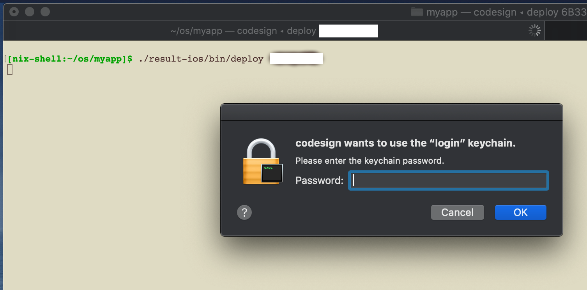

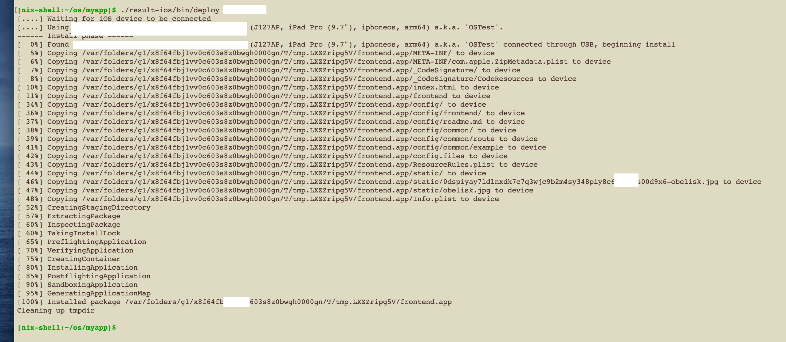

If there are no errors and the last line says `100% Installed Package` you can open the device and look for the Obelisk app:

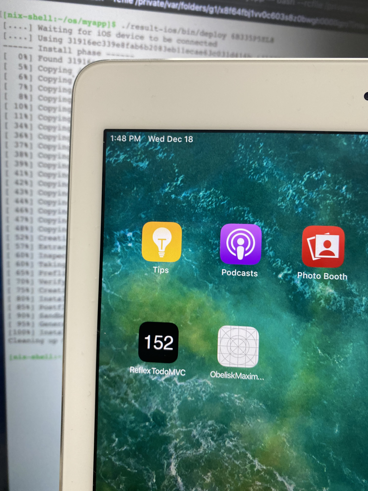

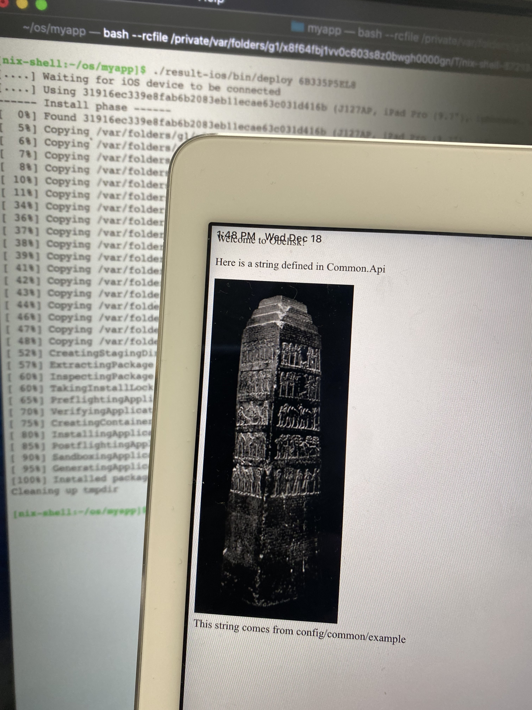

Congratulations, you have deployed an Obelisk app on an iOS device.

You are now ready to create your own multi-platform application using Obelisk!
